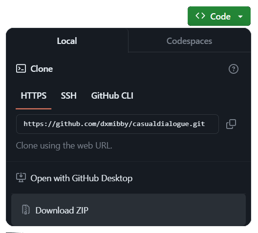

# casualdialogue
  Makes NPC dialogue more casual

 ## How to use
 1. Ensure SMAPI is installed
 2. Make sure you have a recent version of [Content Patcher](https://www.nexusmods.com/stardewvalley/mods/1915) in your Mods folder
 3. At the top of the page, click the ```Code``` button, then the ```Download ZIP``` button to download the mod
    
 5. Unzip the file
 6. Rename the folder to ```[CP] casualdialogue```
 7. Move the folder to your mods folder

Once the mod is installed, your files should look like:
```
Stardew Valley/
└── Mods/
    ├── Content Patcher
    └── [CP] casualdialogue/
        ├── content.json
        └── manifest.json
```
